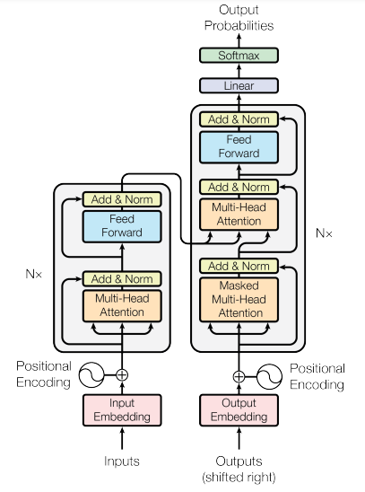
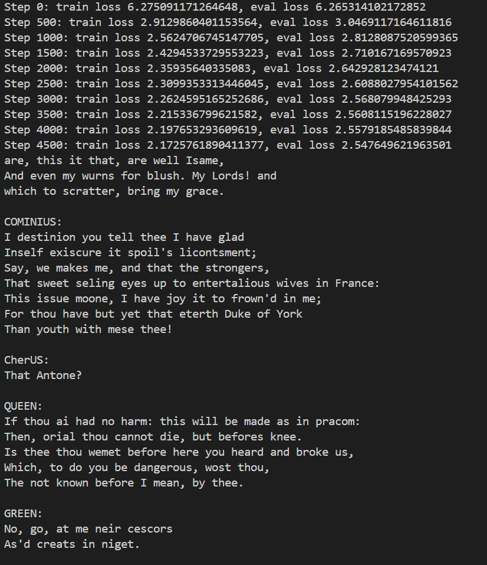

# BPE_GPT
An implementation of a Generatively Pre-Trained Transformer Model, integrated with a Byte Pair Tokenizer that can with regex forced breaks and capabilities for special tokens. Largely based off of OpenAI co-founder Andrej Karpathy's online youtube miniseries "Neural Networks: Zero to Hero".

Written in Pytorch, this implementation follows the transformer architecture below, which was introduced in the paper "Attention is All you Need".

## The Generatively Pre-Trained Model (GPT)

A generatively pre-trained model, is a transformer decoder that is able to generate text, optionally given context, from having been trained on (hopefully a large amount of) training text. In this project, 40,000 lines of Shakespeare was used for the model to mimick. It is important to note that a generatively pre-trained model is not a model that has been finetuned, and can hence not respond to a prompt. It is soley used for text generation, and if a prompt is given it will interpret that prompt as context for text generation rather than a question to be answered.

## The Byte-Pair Tokenizer
A Byte-Pair schema (BPE) is a popular choice for a tokenizer given its versatility and performance. Through iteratively finding the most common pairs within a diverse sample text, and merging them into a new token, BPE creates tokens based off of their occurence in this sample text. This often shows improvements in efficiency and eliminates bias introduced from more restrictive tokenization schemes. 

### Forced Breaks in BPE With Regex
One problem however, that arises in BPE is the tendency for punctuation and other grammatical concepts to take up a large portion of the vocabulary. For example it would be suboptimal to store "dog.", "dog,", "dog!", and "dog?" as tokens in comparison to "dog" and these respective punctuation marks. Hence regex is used to find the punctuation and other undesirable elements and separate them before running BPE, such that they should not "bleed into" the rest of the text.

### Special Tokens
Often it is the case that when training a GPT model on a large ammount of text, one would introduce special tokens to indicate extra meaning to these documents. Common examples tend to be tokens indicating the start and beginning of a document so that when training multiple documents, a model will infer that a new document has began and all previous text is unrelated for what is to come. Currently, in `byte_pair.py`, a special token is used `<|endoftext|>` and added to the end of the sample text. However, this token would gain most of its meaning from being trained on multiple documents.